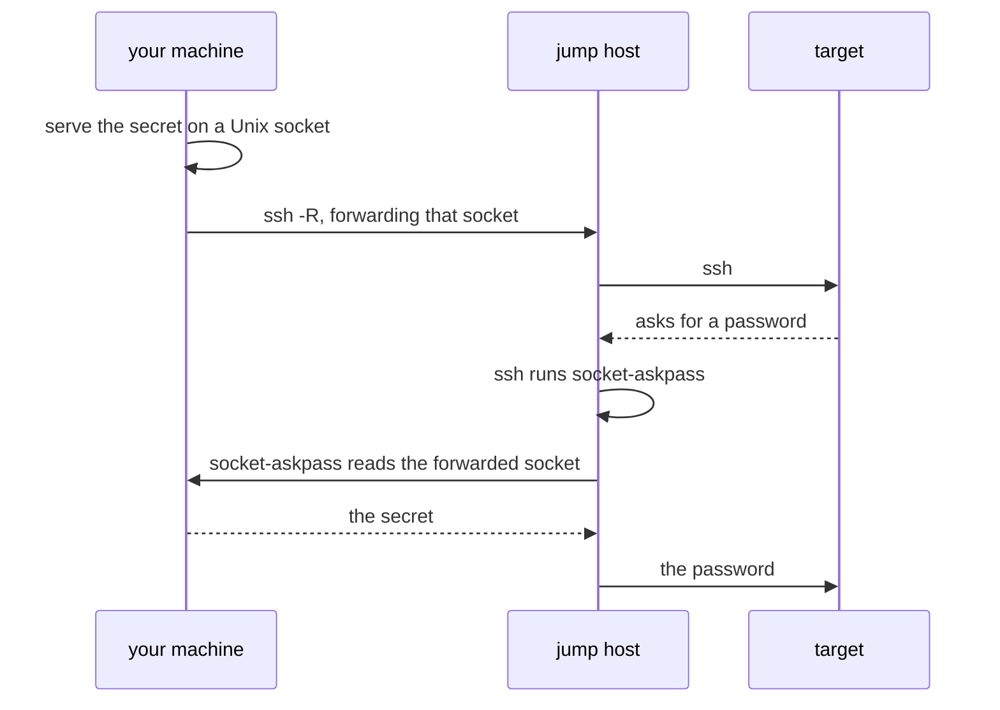

# Logging in through a jump host

When a host is reachable only from a jump host that does not allow `ssh -J`,
`ssh` has to run on the jump host, and asks for the password there. If the jump
host allows `ssh -J`, none of this is needed: `ssh` runs on your machine and
prompts you there.

`ssh-jump.py` answers that prompt with a password kept on your machine. With
`socket-askpass` installed on the jump host:

```
ASKPASS_SECRET_COMMAND='your-secret-command' \
  examples/ssh-jump.py jump.example.com ops@10.0.0.12
```

`your-secret-command` is anything that prints the password to stdout, such as
the command-line interface of a password manager. The arguments after the jump
host are passed to `ssh` on the jump host, so options or a command can follow
as with `ssh` itself.



This does for a password what agent forwarding (`ssh -A`) does for a key: a
socket on your machine is forwarded, and read on the jump host only when asked
for. The password is never in an environment variable or a file on the jump
host. It is served only while the script runs, and nothing is served when the
command fails.

## Requires

- Python 3.8 or later on your machine
- `socket-askpass` in a directory on `PATH` on the jump host
- OpenSSH 8.4 or later on the jump host, for `SSH_ASKPASS_REQUIRE=force`
- `AllowStreamLocalForwarding` left enabled on the jump host. A jump host
  that refuses TCP forwarding may leave this at its default without meaning
  to; check that its policy allows the forward before relying on it

## Limitations

- While the connection lasts, the forwarded socket is reachable by the same
  user on the jump host, as a forwarded agent is. The secret stays out of the
  environment and off the disk; it is not out of that user's reach
- When the connection drops during an interactive session, the socket file can
  be left on the jump host
